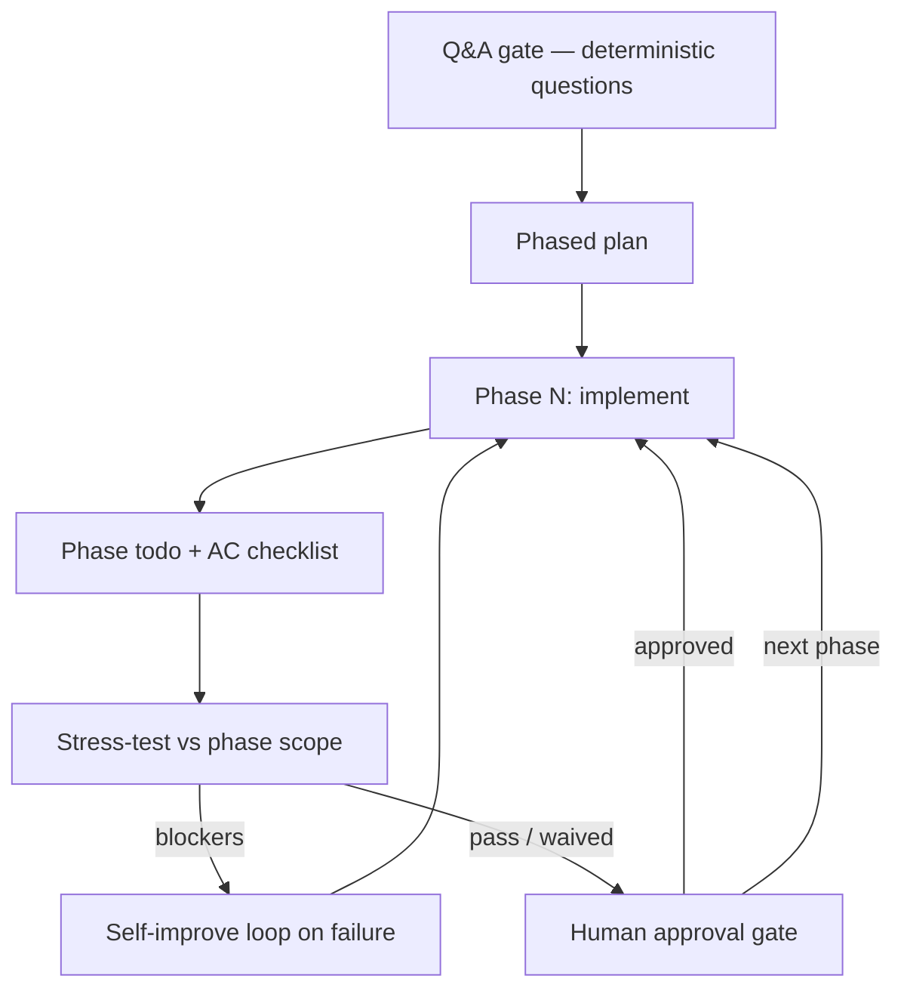

# Phased delivery pipeline (Preflight v0.1.1)

**Progress over perfection.** Ship value in phases; each phase has its own acceptance criteria, stress-test, and human gate. Do not drift into the next phase without explicit approval.

This document is the canonical description of the loop encoded in `spec-driven-development` and supported by `adversarial-self-critique` and `requirements-engineer`.

---

## Overview



---

## Step 1: Q&A gate (before planning)

**Goal:** Remove ambiguity *before* drafting a plan.

The agent asks **deterministic clarifying questions** first — not open-ended brainstorming.

| Pattern | Example |
|---------|---------|
| **Constrained choice** | “Scope for v1: (A) read-only dashboard, (B) dashboard + export, (C) defer dashboard — pick one.” |
| **Binary with escape** | “Should FR-03 apply to guest users? Yes / No / Not in this initiative.” |
| **Bounded numeric** | “Max acceptable p95 latency: 200ms / 500ms / 1s / other (specify).” |
| **Explicit default** | “If no reply, I will assume (A) and document it in the spec assumptions table.” |

Rules:

- Batch questions in one message when they are independent; use **one question at a time** when answers change what you ask next.
- Record answers in the spec or phase artifact — do not rely on chat memory alone.
- If critical facts are still missing after one round, list **blocking unknowns** and stop planning until resolved.

`requirements-engineer` owns problem/FR clarity upstream; `spec-driven-development` runs the Q&A gate before phased planning.

---

## Step 2: Phased implementation plan

From Q&A answers, produce a **phased plan** (not only a monolithic task dump).

Each phase must include:

| Field | Content |
|-------|---------|
| **Phase ID** | `P1`, `P2`, … stable for the initiative |
| **Outcome** | User-visible or integration outcome for *this phase only* |
| **In scope / out of scope** | Explicit boundaries |
| **Acceptance criteria** | Testable checklist tied to FR/NFR IDs where they exist |
| **Dependencies** | Prior phases, env, data, flags |
| **Verification** | Commands or manual steps to prove AC |

Default artifact: `docs/plans/<slug>-plan.md` with a **Phases** section, or one file per phase under `docs/plans/<slug>/`.

Use template: [`skills/spec-driven-development/templates/phase-gate.md`](../skills/spec-driven-development/templates/phase-gate.md).

**Global gate:** No production implementation until the human approves the **overall spec + phased plan** (same hard gate as v0.1.0). Phases refine *how* work is sliced; they do not bypass plan approval.

---

## Step 3: Per-phase todo checklist

When **entering** a phase, materialize a markdown checklist scoped to that phase only.

- Checkboxes map 1:1 to acceptance criteria for the phase.
- In-progress work stays in the current phase file or a linked `phase-Pn-todo.md`.
- Do not carry open items silently into the next phase — move them explicitly (new phase, CR, or Won’t).

---

## Step 4: Stress-test before leaving a phase

Before requesting human sign-off on a phase, run `adversarial-self-critique` **scoped to the current phase**:

- Findings must reference phase AC and in-scope items only.
- Compare deliverables to the **traceability matrix** when REQ IDs exist (Must coverage for this phase).
- Apply **ambiguity detection** (see adversarial skill): vague success language, untested claims, undefined terms.

Max **two** revise passes per stress-test invocation; then stop and present remaining defects.

---

## Step 5: Human approval gate (no silent phase drift)

After phase stress-test passes (zero blockers or explicit waiver), **stop** and ask:

> Phase **Pn** complete per `[artifact paths]`. Stress-test: [0 blockers | waived F-..]. **Approve to start Pn+1**, or list corrections.

**Do not** interpret partial praise, silence, or unrelated messages as phase approval.

Record approval in the phase artifact:

```markdown
**Phase Pn approved:** YYYY-MM-DD by <name/role>
```

Only then begin implementation or planning work for the next phase.

---

## Step 6: Self-improve loop (on mistakes or ambiguity)

When a run surfaces repeated mistakes, ambiguous output, or gate bypass attempts:

1. **Name the failure mode** (e.g. “skipped Q&A gate”, “phase AC not testable”).
2. **Propose a concrete edit** to the relevant `SKILL.md`, or append to `skills/<id>/lessons.md` / a short note in project `CHANGELOG` if the lesson is repo-specific.
3. **Show the diff or bullet list** of proposed skill changes to the human.
4. **Do not** commit or push to the Preflight skill repo unless the user asks.

The loop is: **observe defect → tighten skill text → next run loads sharper guidance.**

---

## Relationship to other skills

| Skill | Role in pipeline |
|-------|------------------|
| `requirements-engineer` | Problem, FR/NFR, baseline before spec |
| `spec-driven-development` | Q&A → phased plan → phase todos → gates |
| `traceability-matrix` | Must coverage per phase / release |
| `adversarial-self-critique` | Phase-scoped stress-test before each gate |

---

## GitHub Copilot

Copilot adapters are **checklist reminders**; the full phased loop (multi-turn gates, revise passes, self-improve proposals) is **Cursor/Claude-native**. See [AGENTS.md](../AGENTS.md).

---

## Roadmap (v0.2 — not built in v0.1.1)

**Strategic requirements engineering** — deeper stakeholder strategy, value modeling, and long-horizon REQ governance. Tracked in [README roadmap](../README.md); do not implement in v0.1.1.
