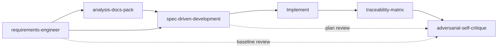

# Preflight skill map

## Pipeline view

## Skill reference

| ID | Load when… | Primary output | Blocks |
|----|------------|----------------|--------|
| `requirements-engineer` | Problem vague; no FR IDs; stakeholder conflict | `03-requirements.md`, baseline | Implementation without problem + Must FR |
| `analysis-docs-pack` | Need full analyst `docs/01–09` | Scaffolded docs tree | Nothing (scaffolding only) |
| `spec-driven-development` | Multi-file feature; spec-first ask | Spec + plan artifacts | Code until **plan approved** |
| `traceability-matrix` | FR IDs exist; pre-release | `08-traceability-matrix.md`, orphan report | “Done” with Must orphans |
| `adversarial-self-critique` | Before ship; high-risk answer | Findings table + stress-tested note | Ship with blockers (unless waiver) |

## Triggers (description keywords)

Agents match skills via frontmatter `description`. Human triggers:

- “Run preflight”, “requirements first”, “no code yet” → `requirements-engineer`
- “Scaffold docs pack”, “01–09 docs” → `analysis-docs-pack`
- “Spec driven”, “plan before code” → `spec-driven-development`
- “Traceability”, “RTM”, “orphan requirements” → `traceability-matrix`
- “Stress test”, “adversarial review”, “red team this” → `adversarial-self-critique`

## File conventions (generic)

| Artifact | Default path |
|----------|--------------|
| Context | `docs/01-context.md` |
| Requirements | `docs/03-requirements.md` |
| Traceability | `docs/08-traceability-matrix.md` |
| Acceptance tests | `docs/09-acceptance-tests.md` |
| Spec | `docs/specs/<slug>.md` |
| Plan | `docs/plans/<slug>-plan.md` |

Projects may relocate paths if `docs/README.md` indexes them.

## Parked (roadmap)

| Skill | Intent |
|-------|--------|
| `writing-implementation-plans` | Bite-sized tasks after approved plan |
| `verification-before-completion` | Command output before success claims |
| Orchestrator | Single skill to chain gates with less manual naming |
