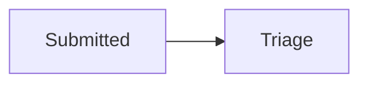

# Analysis Docs Pack

## Purpose

Create a **consistent `docs/` pack** so humans and agents share one narrative: context → people → requirements → behavior → data → verification.

Paths are **generic** — not locked to any org name. Copy templates from this skill into the target repo's `docs/` folder.

## When to use

- New case study or internal product with analyst deliverables
- Repo needs structure before requirements/engineering depth
- User mentions “analysis pack”, “systems analyst docs”, or “01–09 docs”

Skip when the repo already has a maintained pack; instead gap-fill missing files only.

## Pack index (01–09)

| File | Focus |
|------|--------|
| `01-context.md` | Problem, vision, scope, constraints |
| `02-stakeholders-raci.md` | Stakeholders, RACI, communication |
| `03-requirements.md` | FR/NFR IDs, MoSCoW, AC (pair with `requirements-engineer`) |
| `04-use-cases-stories.md` | Use cases, user stories, scenarios |
| `05-process-as-is-to-be.md` | Process models, states, SLAs |
| `06-data-model.md` | Entities, relationships, key fields |
| `07-sequence-flows.md` | Sequence / interaction diagrams |
| `08-traceability-matrix.md` | REQ → design → test (pair with `traceability-matrix`) |
| `09-acceptance-tests.md` | AT catalog mapped to FRs |

Optional hub: `docs/README.md` with links and reading order.

## Workflow

### 1. Detect baseline

- List existing `docs/*.md`
- Note gaps vs 01–09
- Ask human: **full scaffold** or **fill gaps only**

### 2. Scaffold

For each missing file:

1. Copy template from `skills/analysis-docs-pack/templates/docs/<file>`
2. Replace `[Initiative]`, `[Date]`, placeholders
3. Add `> Generated from Preflight analysis-docs-pack — customize before baseline`

Do **not** invent proprietary facts; use `TBD` and open questions.

### 3. Cross-link

- `01-context` links forward to `03-requirements`
- `04-use-cases` references FR IDs
- `08-traceability` references FR and AT IDs
- `09-acceptance-tests` one section per Must FR minimum

### 4. Quality bar before handoff

- [ ] Every Must FR in `03` appears in `08` and `09`
- [ ] Process doc references actors from `02`
- [ ] Data entities support use cases in `04`
- [ ] No empty headings (use `TBD` explicitly)

### 5. Review

Ask human to skim `docs/README.md` reading order and approve or mark sections `TBD`.

## Generic layout

```
docs/
  README.md                 # optional index
  01-context.md
  02-stakeholders-raci.md
  03-requirements.md
  04-use-cases-stories.md
  05-process-as-is-to-be.md
  06-data-model.md
  07-sequence-flows.md
  08-traceability-matrix.md
  09-acceptance-tests.md
```

Projects may nest (`docs/analysis/`) if documented in `docs/README.md` — keep numeric prefixes for sort order.

## Diagrams

Prefer **Mermaid** in markdown for GitHub/Cursor rendering:

````markdown

````

Keep diagrams small; complex flows split by scenario in `07`.

## Integration

| Skill | Role |
|-------|------|
| `requirements-engineer` | Fills `03` with baselined FR/NFR |
| `traceability-matrix` | Maintains `08` |
| `spec-driven-development` | Spec/plan may live in `docs/specs/` alongside pack |

See [docs/alignment-with-docs-pack.md](../../docs/alignment-with-docs-pack.md) in the Preflight repo.

## Anti-patterns

| Anti-pattern | Fix |
|--------------|-----|
| Requirements only in chat | Persist to `03` |
| Traceability after release | Seed `08` when FR-01 is written |
| 06-data-model before use cases | Draft entities from `04` scenarios |
| Copy-paste pack without deleting placeholders | Search for `[` before commit |
