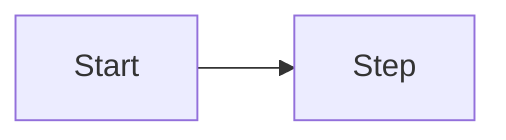

# Process — as-is & to-be — [Initiative name]

**Document:** 05-process-as-is-to-be  
**Last updated:** YYYY-MM-DD

## As-is process

**Summary:** 

| Step | Actor | Pain points |
|------|-------|-------------|
| 1 | | |

## To-be process

**Summary:** 

## State model (if workflow)

| State | Description | Entry | Exit |
|-------|-------------|-------|------|
| | | | |

## Business rules & SLAs

| Rule / SLA | Value | Related FR |
|------------|-------|------------|
| | | |

## Process ↔ requirements map

| Process step | FR IDs |
|--------------|--------|
| | |
