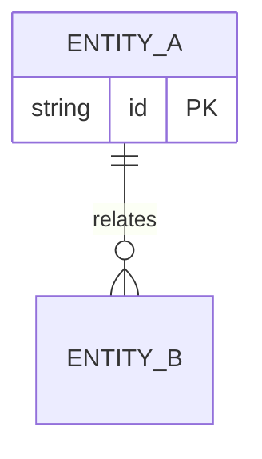

# Data model — [Initiative name]

**Document:** 06-data-model  
**Last updated:** YYYY-MM-DD

## Conceptual model

## Entity dictionary

| Entity | Description | Owner / source system |
|--------|-------------|------------------------|
| | | |

## Key attributes

### [Entity name]

| Field | Type | Required | Notes | FR |
|-------|------|----------|-------|-----|
| | | | | |

## Data lifecycle & retention

| Data | Created | Updated | Retained | Deleted |
|------|---------|---------|----------|---------|
| | | | | |

## Integration touchpoints

| System | Direction | Payload / entity | FR |
|--------|-----------|------------------|-----|
| | | | |
