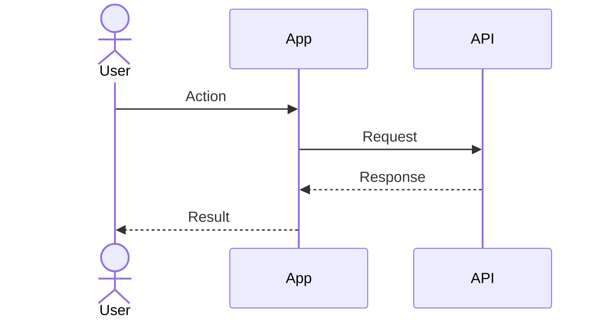

# Sequence & interaction flows — [Initiative name]

**Document:** 07-sequence-flows  
**Last updated:** YYYY-MM-DD

## Flow index

| ID | Name | Related UC / FR |
|----|------|-----------------|
| SF-01 | | UC-01, FR-01 |

## SF-01 — [Name]

### Notes

- **Preconditions:** 
- **Failure handling:** 
- **Related tests:** AT-##
